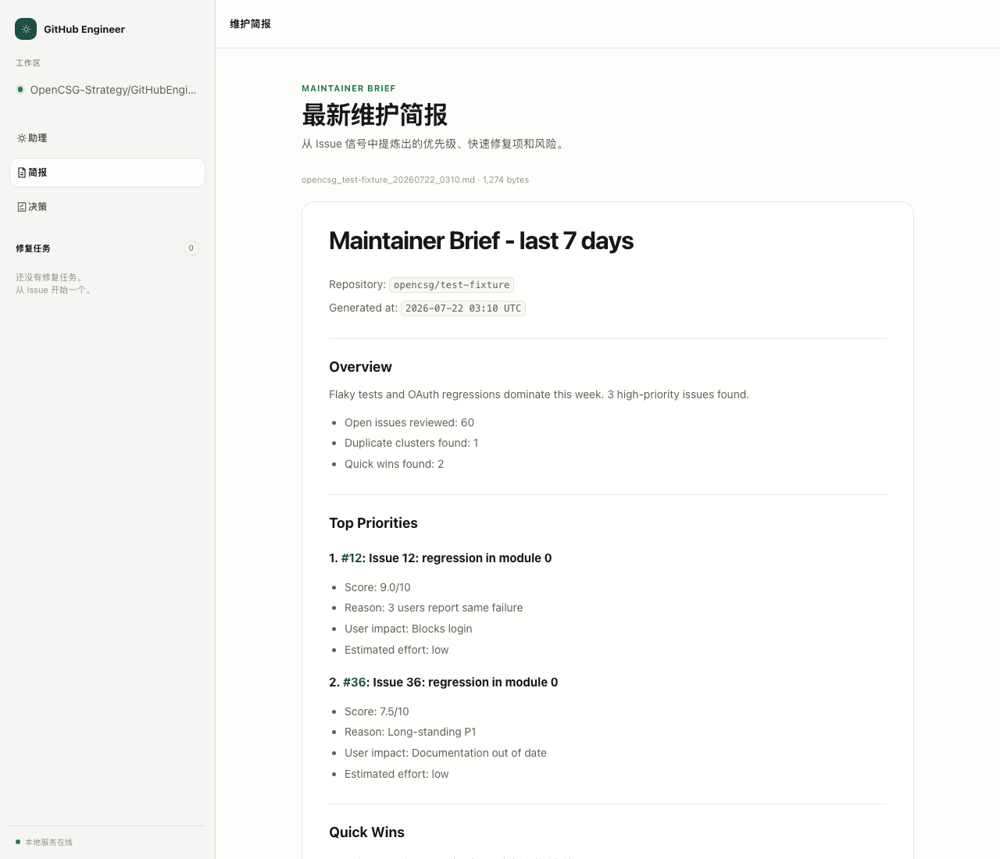
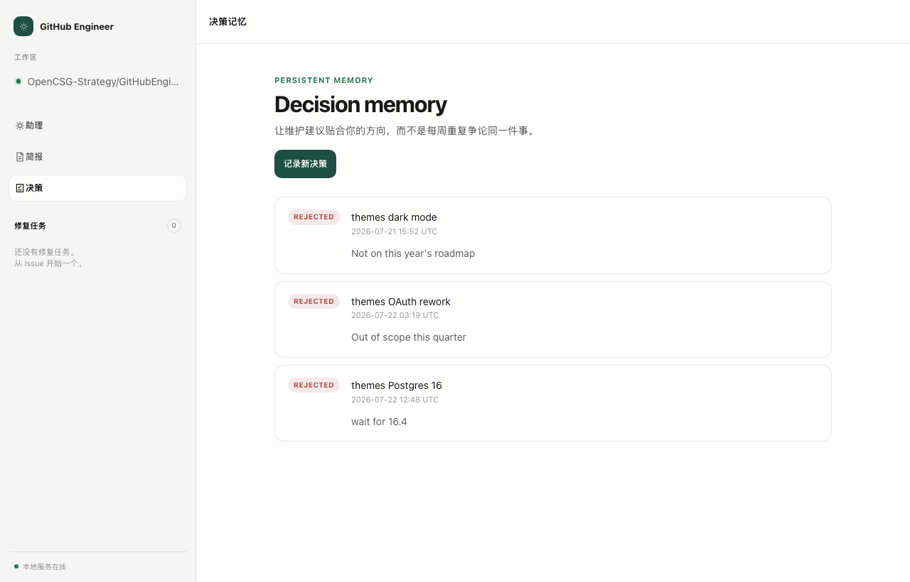
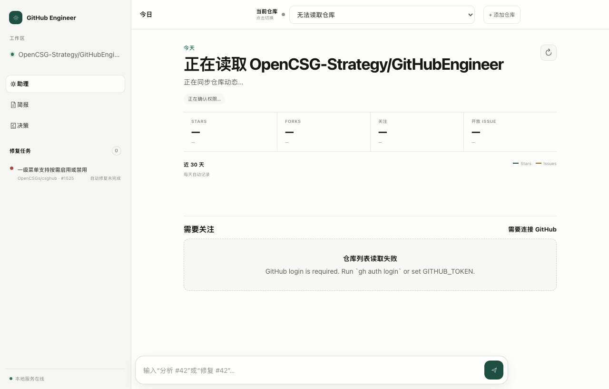
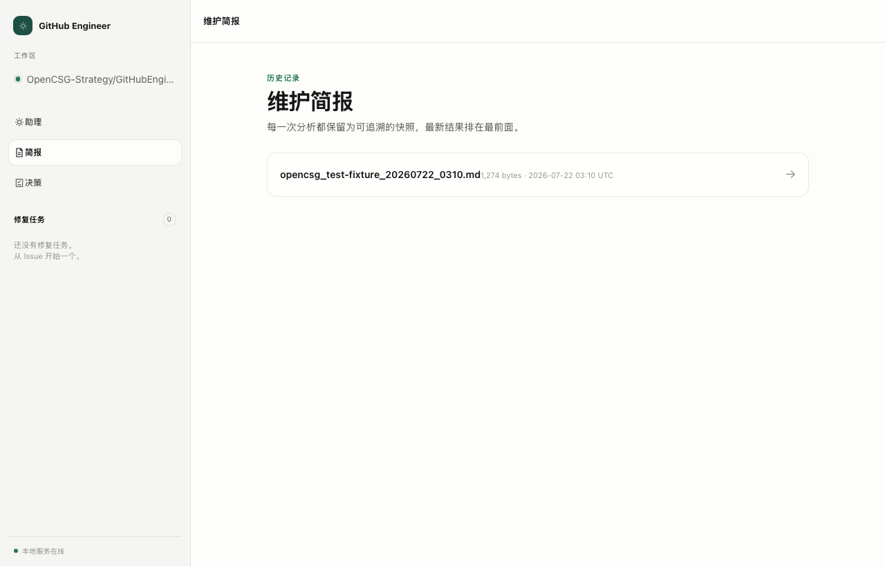

# GitHub Engineer

> **A maintainer-first brief generator for GitHub repos.** Read every open issue, rank the ones that matter, and hand a bounded task to your coding agent — without ever touching the repo by default.

GitHub Engineer doesn't write code. It doesn't open PRs, comment on issues, or apply labels. What it does is the part you actually have to think about: **decide which 3 issues are worth your attention this week, and prepare a tight, scope-bounded task for the agent that's going to do the work.**

Three surfaces, one engine:

- **CLI** — `ghe --config .ghe/config.yml --repo owner/name` and you're done.
- **Web UI** — `ghe --serve`, open `http://127.0.0.1:8765/ui/`, browse briefs, record decisions through a conversation-first interface.
- **GitHub Action** — drop `.github/workflows/maintainer-brief.example.yml` in, get a weekly brief in your Step Summary.

The brief is a single Markdown file. The decision memory is one YAML file. The history baseline is a folder of JSON snapshots. The handoff plan is a dry-run by default — `--execute` is the only thing that actually starts a coding agent.

[](LICENSE)
[](https://www.python.org/downloads/)
[](pyproject.toml)
[](tests/)
[](.github/workflows/test.yml)
[](#model)

---

## Table of Contents

- [What it does](#what-it-does)
- [See it in action](#see-it-in-action)
- [Quick start](#quick-start)
- [How it works](#how-it-works)
- [Local usage](#local-usage)
- [Local web service](#local-web-service)
- [Desktop app (Tauri)](#desktop-app-tauri)
- [GitHub Action](#github-action)
- [CLI reference](#cli-reference)
- [Configuration](#configuration)
- [Environment variables](#environment-variables)
- [Decision / Task / Agent workflow](#decision--task--agent-workflow)
- [Repository layout](#repository-layout)
- [Benchmarks](#benchmarks)
- [Cost](#cost)
- [Example output](#example-output)
- [Why not just use Copilot / Agentic Workflows?](#why-not-just-use-copilot--agentic-workflows)
- [FAQ](#faq)
- [Troubleshooting](#troubleshooting)
- [Project links](#project-links)
- [Limits](#limits)
- [License](#license)

---

## What it does

Every Monday your GitHub inbox has 50 new issues. Most of them aren't worth a maintainer's attention. A few are. The hard part isn't doing the work — it's picking the right work, and giving the agent enough context to actually do it well.

**GitHub Engineer handles the picking and the context-prep.** You handle the rest.

| Capability | What you get | File it touches |
| --- | --- | --- |
| **Read** | Every open issue in one or more repositories, paginated, rate-limit-safe. | (no write) |
| **Rank** | Top 3 priorities, each with a score, a one-line reason, the user impact, and an estimated effort. | (no write) |
| **Brief** | A single Maintainer Brief in Markdown. | `reports/owner_name_YYYYMMDD.md` |
| **Decide** | Record a maintainer decision: `accepted` / `rejected` / `deferred`, with theme, reason, goal, and guardrail. | `.ghe/memory/decisions.yml` |
| **Remember** | Every decision is remembered locally. Rejected themes are filtered out of future briefs. | (read-only) |
| **Prepare** | Turn an approved recommendation into a bounded Agent-ready task with reproduction steps, acceptance criteria, risks, and test guidance. | `tasks/owner_name_issue_N.md` |
| **Delegate** | Plan a dry-run handoff to Codex, Claude Code, or any allowlisted CLI. `--execute` actually starts the agent. | (no write until `--execute`) |
| **Trend** | Week-over-week diff: which issues entered or left the Top N, which clusters are growing. | `.ghe/history/*.json` |
| **Cap spend** | Hard cap on the prompt size and the number of candidate issues. | (config) |
| **Step Summary** | When running as an Action, the same brief is appended to `$GITHUB_STEP_SUMMARY`. | `reports/*.md` artifact |

By default it does **not** comment on issues, create discussions, apply labels, or modify any code. The only write paths are local files (`reports/*.md`, `.ghe/history/*.json`, `.ghe/memory/decisions.yml`, `tasks/*.md`) and, when running as an Action, the optional `$GITHUB_STEP_SUMMARY`.

---

## See it in action

A real brief, rendered in the local web UI. This is what `ghe --serve` shows you when you open `http://127.0.0.1:8765/ui/briefs/<file>` — a Maintainer Brief for `opencsg/test-fixture`, ranked against the configured goal and guardrail, with the clickable `[[#N](url)]` link rendering, the Quick Wins section, and the Trend line:



A second screenshot of the same UI: **Decision Memory**. This is what `ghe --record-decision` produces. Rejected themes are filtered out of future briefs — so the same work doesn't come back to haunt your inbox every Monday.



The full screenshot set is under [`docs/screenshots/`](docs/screenshots/):

- [`web-ui-home.png`](docs/screenshots/web-ui-home.png) — Assistant home (today's repo, top metrics, 30-day trend, needs-attention inbox).
- [`web-ui-briefs.png`](docs/screenshots/web-ui-briefs.png) — Brief history.
- [`web-ui-brief-detail.png`](docs/screenshots/web-ui-brief-detail.png) — One brief rendered as HTML.
- [`web-ui-decisions.png`](docs/screenshots/web-ui-decisions.png) — Decision memory with the in-page decision dialog.

All four are real Chrome headless screenshots of the local service — no mockup, no Figma. The layout follows the system light/dark appearance (see [`src/web_ui.py`](src/web_ui.py) for the `prefers-color-scheme: dark` rules).

---

## Quick start

Five commands from clone to first brief. No token, no proxy, no daemon.

```bash
# 1. Clone and create a virtual environment
git clone https://github.com/your-org/github-engineer.git
cd github-engineer
make venv && make install-dev

# 2. Write a starter config
ghe --init

# 3. Set the minimum env vars
export LLM_API_KEY="sk-..."          # any OpenAI-compatible key
export GITHUB_TOKEN="ghp_..."        # optional for public repos, recommended

# 4. Generate your first brief (~10–30 s, < $0.10 with gpt-4o-mini)
ghe --config .ghe/config.yml --repo your-org/your-repo

# 5. Inspect the report
ls reports/                           # → reports/your-org_your-repo_YYYYMMDD.md
ghe --show-latest                     # or print the newest one to stdout
```

That's the whole loop. From here the fun is in the **Decision / Task / Agent workflow** below — you can chain `brief → record → prepare → delegate` and have a coding agent pick up the work in a few minutes.

---

## How it works

The engine is a four-stage pipeline. Each stage is a separate module with a one-page contract in [`ARCHITECTURE.md`](ARCHITECTURE.md). The diagram below is identical to the one in `ARCHITECTURE.md`; the prose is the same; the difference is that you can read this and start.

```
                  +----------------------+
                  | .ghe/config.yml      |
                  | .ghe/memory/         |
                  | .ghe/history/        |
                  +----------+-----------+
                             |
                             v
+--------+        +---------+----------+        +-----------------+
|  ghe   |  ----> |   src/main.py       |  ----> |  src/github_     |
|  CLI   |        |   (argparse + glue) |        |  client.py       |
+--------+        +---------+----------+        +--------+--------+
                             |                            |
                             v                            v
                  +----------+-----------+      +---------+----------+
                  |  src/llm_client.py   |      |  GitHub REST API   |
                  |  (OpenAI-compatible) |      +--------------------+
                  +----------+-----------+
                             |
                             v
                  +----------+-----------+
                  |  src/analyzer.py     |
                  |  + memory_manager    |
                  |  + history.py        |
                  +----------+-----------+
                             |
                             v
                  +----------+-----------+
                  |  src/report_         |
                  |  generator.py        |
                  +----------+-----------+
                             |
                  +----------+----------------------+
                  |                                 |
                  v                                 v
        +-------------------+              +-------------------+
        | reports/*.md      |              | tasks/*.md        |
        | + history/*.json  |              | (when --pipeline) |
        +-------------------+              +---------+---------+
                                                      |
                                                      v
                                          +-----------+----------+
                                          |  src/delegation.py   |
                                          |  (--execute opt-in)  |
                                          +----------------------+
```

**The safety story in one line**: reads are free, writes are explicit, the model cannot fake URLs, and `--execute` is the only way to actually start a coding agent. Full contract in [`ARCHITECTURE.md`](ARCHITECTURE.md).

---

## Local usage

### What you need on hand

- **Python 3.11+** (3.11, 3.12, 3.13 are tested in CI on Ubuntu and macOS).
- **A GitHub token** that can read issues. Public repos work without one, but a token raises the rate limit from 60/hr to 5 000/hr — well worth it on Monday mornings.
- **An OpenAI-compatible API key.** OpenAI, Azure OpenAI, Anthropic-via-proxy, Ollama, LiteLLM, vLLM, all work. See the [Configuration](#configuration) section for `LLM_BASE_URL`.

### Install

Two paths. Pick by what you're here to do.

```bash
# Use it: install from PyPI or the wheel
python3 -m venv .venv
source .venv/bin/activate
python -m pip install -r requirements.txt

# Hack on it: editable install with dev extras
pip install -e ".[dev]"
```

The editable install also registers the `ghe` and `ghe-web` console scripts, so the rest of this README can assume `ghe ...` works from anywhere in your shell.

### Configure

```bash
ghe --init             # writes a starter .ghe/config.yml from .ghe/config.example.yml
# or, if you prefer to do it by hand:
cp .ghe/config.example.yml .ghe/config.yml
```

`ghe --init` is idempotent: it won't clobber an existing config. Edit the resulting `.ghe/config.yml` to point at your repo, then set the environment variables.

```bash
export GITHUB_TOKEN="github_token"     # optional for public repositories
export LLM_API_KEY="model_api_key"
export LLM_MODEL="gpt-4o-mini"         # default
export LLM_BASE_URL=""                  # leave empty for the OpenAI default endpoint
```

`LLM_BASE_URL` is required only when you're pointing at something other than OpenAI. Every `${VAR}` placeholder in `.ghe/config.yml` is expanded from the environment at load time.

### Run

```bash
ghe --config .ghe/config.yml --repo owner/name
```

The brief lands in `reports/owner_name_YYYYMMDD.md`. With `output.format: action-summary` in the config, the same Markdown is also appended to `$GITHUB_STEP_SUMMARY` when that env var is set — which is exactly what the GitHub Action does.

### Multi-repository briefs (v1.0+)

```yaml
# .ghe/config.yml
repos:
  - "your-org/your-repo"
  - "your-org/your-other-repo"
```

One `ghe ...` invocation now writes one report per entry. A comma-separated `--repo owner/a,owner/b` overrides the list for that one run. **One repository failing does not stop the others** — the summary line at the end of the run tells you how many succeeded.

### Going further

- **Browse briefs in a UI** instead of `cat`ing Markdown files — see [Local web service](#local-web-service) below.
- **Run as a native macOS app** with traffic-light transparency — see [Desktop app (Tauri)](#desktop-app-tauri).
- **Weekly digest in your PR review queue** — see [GitHub Action](#github-action).
- **Pick a single issue and hand it to Codex or Claude Code** — see [Decision / Task / Agent workflow](#decision--task--agent-workflow).

---

## Local web service

When you don't want to live in a terminal, `ghe --serve` starts a read-only maintainer-assistant UI on `127.0.0.1:8765` (override with `GHE_SERVE_PORT` or `--serve-host`). Open it in any browser; the layout adapts to desktop and mobile and follows the system light/dark appearance.

```bash
ghe --serve --serve-host 127.0.0.1
# github-engineer serving on http://127.0.0.1:8765
```

| Route | Method | Purpose |
| --- | --- | --- |
| `/ui/` | `GET` | Conversation-first maintainer assistant. |
| `/ui/briefs` | `GET` | Responsive brief history. |
| `/ui/briefs/<file>` | `GET` | Render one exact brief as HTML. |
| `/ui/decisions` | `GET` | Decision memory with an in-page decision dialog. |
| `/` | `GET` | Index of all briefs as JSON. |
| `/briefs` | `GET` | Same as `/`. |
| `/brief/<owner>/<repo>` | `GET` | Latest brief for the repository, returned as Markdown. |
| `/decisions` | `GET` | Decision memory as JSON. |
| `/decisions.txt` | `GET` | Decision memory as plain text (one line per record). |
| `/decisions` | `POST` | Record a new decision. JSON body with `status` (`accepted` / `rejected` / `deferred`), `theme`, `reason`, `goal`, `guardrail`, `issue_number`. Returns 201 + the persisted record. |
| `/healthz` | `GET` | Liveness probe for load balancers. |





**The security model is the minimum you need it to be:**

- **No authentication.** It binds to `127.0.0.1` by default; only use `--serve-host 0.0.0.0` when you intentionally want to expose it on the LAN.
- **The only write path is `POST /decisions`.** It writes to the same `.ghe/memory/decisions.yml` as the CLI. Everything else is read-only.
- **No background daemon.** Run it under `systemd`, `tmux`, or a process manager for long-running use.

---

## Desktop app (Tauri)

The primary local experience is a Tauri 2 desktop shell. The app starts the Python analysis service automatically and loads the same conversation UI in a native WebView (1180×760 on first launch, light/dark follows the system appearance, hidden-inset title bar with the macOS traffic lights).

```bash
cargo install tauri-cli --version 2.11.4 --locked
./script/build_and_run.sh            # default: foreground
./script/build_and_run.sh --debug    # RUST_BACKTRACE=1 + RUST_LOG=debug
./script/build_and_run.sh --logs     # tee to .codex/run/desktop.log
./script/build_and_run.sh --telemetry # stream macOS unified logs for the app process
./script/build_and_run.sh --verify   # CI-style: launch, wait for the window, exit 0/1
```

The desktop shell is configured by [`src-tauri/tauri.conf.json`](src-tauri/tauri.conf.json):

- `beforeDevCommand`: starts the Python service on `127.0.0.1:8765` (`ghe --serve`).
- `devUrl`: points the WebView at `http://127.0.0.1:8765/ui/`.
- `frontendDist`: serves the conversation UI from `../desktop`.
- `security.csp`: locks scripts to `'self'`; only `127.0.0.1:8765` is allowlisted for `connect-src`.

Codex Desktop exposes the same `./script/build_and_run.sh` as the project **Run** action via [`.codex/environments/environment.toml`](.codex/environments/environment.toml). The web UI screenshots above are exactly what you see in the Tauri WebView — the only thing the native shell adds is the title bar.

---

## GitHub Action

Copy [`.github/workflows/maintainer-brief.example.yml`](.github/workflows/maintainer-brief.example.yml) to `.github/workflows/maintainer-brief.yml` and commit it to the repository where you want briefs. That's the whole setup.

`.ghe/config.yml` is optional for the Action. Without it, the Action uses workflow inputs and environment variables.

**Required secrets**

- `LLM_API_KEY` — your OpenAI-compatible API key.

`GITHUB_TOKEN` is provided by GitHub Actions and is granted the minimum `issues: read` and `contents: read` permissions.

**Optional configuration**

- Set the repository variable `LLM_MODEL` to pick a model (default: `gpt-4o-mini`).
- Set the secret `LLM_BASE_URL` only for an OpenAI-compatible endpoint other than OpenAI's default.
- To use a checked-in configuration file, pass `config-path` to the action. Keep its `output.output_dir` aligned with the action's `report-path` input (both default to `reports/*.md`). Do not put API keys in that file.

The Action writes the brief to the workflow **Step Summary** and uploads `reports/*.md` as an artifact named `maintainer-brief`. The Action is a composite Action (`action.yml`); it installs dependencies, runs `python -m src.main`, and uploads the report. Dependabot tracks the underlying `actions/setup-python` and `actions/upload-artifact` versions in [`.github/dependabot.yml`](.github/dependabot.yml).

---

## CLI reference

`ghe --help` always prints the most current list. The full set of subcommands and flags today is:

| Command | What it does |
| --- | --- |
| `ghe --init` | Write a starter `.ghe/config.yml` from `.ghe/config.example.yml` and exit. Idempotent. |
| `ghe --config <path> --repo owner/name` | Generate a Maintainer Brief. |
| `ghe --config <path> --repo owner/a,owner/b` | Generate briefs for multiple repos in one invocation. |
| `ghe --show-latest [--repo owner/name] [--config <path>]` | Print the most recent brief Markdown to stdout. **No LLM key required.** |
| `ghe --list-decisions` | Print a one-line summary of every record in `.ghe/memory/decisions.yml`. **No LLM key required.** |
| `ghe --record-decision accepted\|rejected\|deferred [--issue-number N ...] [--theme "..."] [--reason "..."] [--goal "..."] [--guardrail "..."]` | Append a maintainer decision. The **only** command that writes `.ghe/memory/decisions.yml`. |
| `ghe --prepare-issue <N> [--allowed-directory src/] [--forbidden-directory infra/]` | Turn a recommended issue into a bounded Agent-ready task in `tasks/`. |
| `ghe --delegate-task tasks/...md --adapter codex\|claude-code\|generic-cli [--agent-repo-path <path>] [--generic-executable aider]` | Plan (and optionally execute) a handoff to a coding agent. **Dry-run by default; pass `--execute` to actually run.** |
| `ghe --pipeline` | Run brief → prepare → delegate dry-run in one shot for the top issue. |
| `ghe --serve [--serve-host 127.0.0.1]` | Start the local read-only web service. |
| `ghe --help` | Print the full flag list. |

If you invoke `ghe` with no subcommand and no `--config` / `--repo`, the CLI prints a hint and exits 2 instead of crashing on a missing config — useful when you forget what you meant to do.

---

## Configuration

See [`.ghe/config.example.yml`](.ghe/config.example.yml) for a fully-annotated template.

**Important fields**

| Field | Purpose |
| --- | --- |
| `repo` | Target repository as `owner/name`, or split as `owner` + `name` / `full_name`. |
| `repos` | Optional v1.0+ list (`- owner/name`) for multi-repo briefs. Takes precedence over `repo` when set. |
| `github.token` | Optional for public repos; recommended to raise the GitHub rate limit. |
| `model.base_url` / `model.api_key` / `model.model_name` | OpenAI-compatible chat settings. `${VAR}` placeholders are expanded from the environment. |
| `output.format` | `markdown` (default) or `action-summary`. The latter also appends to `$GITHUB_STEP_SUMMARY` when the env var is set. |
| `output.output_dir` | Where Markdown reports are written (default `reports/`). |
| `analysis.lookback_days` | How far back to inspect updated issues (min 1, default 7). |
| `analysis.max_issues_for_llm` | How many candidate issues to send to the model (min 1, default 50). Lower this to cap spend. |
| `analysis.min_issue_age_hours` | Drop issues newer than this (default 24) so a brand-new issue is not immediately recommended. |
| `analysis.top_n` | How many top priorities to surface (min 1, default 3). |
| `analysis.max_prompt_chars` | Hard cap on the LLM prompt (default 90 000, ~30 K tokens). The analyzer drops the lowest-signal candidates when the payload would exceed this. |
| `.ghe/memory/decisions.yml` | Optional, versioned maintainer decisions. Written **only** by `--record-decision` / `POST /decisions`. |
| `.ghe/history/` | Optional trend baseline directory. Created on first run. Set `GHE_HISTORY_DIR=""` to disable the trend diff entirely. |

---

## Environment variables

| Variable | Default | Effect |
| --- | --- | --- |
| `GITHUB_TOKEN` | empty | Required for private repos and recommended for public repos (raises the 60 req/hr unauthenticated limit to 5 000/hr). |
| `LLM_API_KEY` | empty | OpenAI-compatible API key. Required for every command that calls the model. Read-only commands (`--show-latest`, `--list-decisions`) do not need it. |
| `LLM_MODEL` | `gpt-4o-mini` | Default model name when the config does not override it. |
| `LLM_BASE_URL` | empty | Base URL of an OpenAI-compatible endpoint. Leave empty for the OpenAI default. |
| `GHE_CONFIG_PATH` | `.ghe/config.yml` | Override the path to the YAML config file. Useful in CI when the file lives outside the working directory. |
| `GHE_HISTORY_DIR` | `.ghe/history` | Override the trend baseline directory. Pass an empty string to disable the trend diff entirely. |
| `GHE_SERVE_PORT` | `8765` | Port for `ghe --serve`. |
| `GHE_LOG_LEVEL` | (unset) | Reserved for future use; ignored today. |
| `GITHUB_STEP_SUMMARY` | (unset) | When set, the report is appended to the file at this path (this is what GitHub Actions uses for `$GITHUB_STEP_SUMMARY`). |

---

## Decision / Task / Agent workflow

The full happy path: **brief → record → prepare → delegate**. This is where the value shows up — every step is a small, named, reversible action.

```bash
# 1. Generate a brief.
ghe --config .ghe/config.yml --repo owner/name
ls reports/                            # → reports/owner_name_*.md

# 2. Record a maintainer decision explicitly. This is the ONLY command that
#    writes .ghe/memory/decisions.yml; normal report generation only reads it.
#    Decisions are deduplicated by (status, theme, issue_number).
ghe --record-decision rejected \
  --issue-number 42 --theme "dark mode" \
  --reason "Not on this year's roadmap" \
  --goal "Improve reliability" --guardrail "Do not add theme customization"

# 3. Generate a fresh brief and prepare one of its recommended issues as a
#    bounded task. Selecting the issue with --prepare-issue IS the explicit
#    approval step — the task file is what the agent will read.
ghe --config .ghe/config.yml --repo owner/name \
  --prepare-issue 42 --allowed-directory src/ --forbidden-directory infra/

# 4. Plan a handoff to a local coding agent. Dry-run by default; no external
#    process is started. The task Markdown is piped to the subprocess over
#    stdin; it is NEVER composed into a shell command.
ghe --delegate-task tasks/owner_name_issue_42.md \
  --adapter codex --agent-repo-path /absolute/path/to/target-repo

# 4a. Or with Claude Code (--print, reads from stdin):
ghe --delegate-task tasks/owner_name_issue_42.md \
  --adapter claude-code --agent-repo-path /absolute/path/to/target-repo

# 4b. Or with any allowlisted CLI (codex, claude, opencode, aider):
ghe --delegate-task tasks/owner_name_issue_42.md \
  --adapter generic-cli --generic-executable aider \
  --agent-repo-path /absolute/path/to/target-repo

# 5. After reviewing the task and the dry-run plan, add --execute to actually
#    start the agent. --execute enforces shell=False and a hard 1 800 s default
#    timeout. Pass --timeout-seconds via execute_delegation's default in
#    src/delegation.py for longer jobs.
ghe --delegate-task tasks/owner_name_issue_42.md \
  --adapter codex --agent-repo-path /absolute/path/to/target-repo --execute
```

The `--adapter generic-cli` path accepts an executable name on the allowlist (`codex`, `claude`, `opencode`, `aider`) and forwards the task Markdown over standard input. Pass `--generic-executable` with the bare name; passing an absolute path or shell metacharacters is rejected by the validator. See [`ARCHITECTURE.md`](ARCHITECTURE.md) for the safety rationale (no silent shell, allowlisted executables, task content as data, not instructions).

Want the whole chain in one command?

```bash
ghe --config .ghe/config.yml --repo owner/name --pipeline
```

`--pipeline` is brief → prepare → delegate dry-run for the top issue of the last (or only) target repo. Add `--execute` to the pipeline to actually start the agent.

---

## Repository layout

```
github-engineer/
├── action.yml                      # composite GitHub Action
├── pyproject.toml                  # packaging + pytest config
├── requirements.txt                # runtime deps (also used by the Action)
├── Makefile                        # venv / install / test / lint / bench / verify
├── README.md                       # you are here
├── ARCHITECTURE.md                 # module contracts + design rationale
├── DESIGN.md                       # v0.1 → v0.4 design notes
├── IMPLEMENTATION_PLAN.md          # delivery plan
├── CHANGELOG.md                    # version history (Keep a Changelog)
├── CONTRIBUTING.md                 # how to file issues / PRs / run tests
├── SECURITY.md                     # vulnerability disclosure
├── CODE_OF_CONDUCT.md              # community guidelines
├── VERIFY.md                       # pre-publish verification checklist
├── TROUBLESHOOTING.md              # expanded troubleshooting recipes
├── LICENSE                         # MIT
│
├── src/                            # the Python package (importable as `src`)
│   ├── main.py                     # argparse + orchestration; the only entry point
│   ├── config.py                   # YAML loader with ${ENV} expansion + Pydantic
│   ├── models.py                   # Pydantic models: DecisionRecord, IssueMetrics, MaintainerBrief
│   ├── github_client.py            # PyGithub wrapper, paginated, max_pages cap
│   ├── llm_client.py               # OpenAI-compatible chat + last_usage capture
│   ├── analyzer.py                 # decision logic, prompt budget, de-dupe
│   ├── report_generator.py         # MaintainerBrief → Markdown
│   ├── memory_manager.py           # .ghe/memory/decisions.yml read/write
│   ├── history.py                  # .ghe/history/*.json baseline + week-over-week diff
│   ├── task_preparer.py            # recommended issue → bounded Agent-ready task
│   ├── delegation.py               # Codex / Claude Code / generic-cli adapter (allowlist)
│   ├── web_ui.py                   # conversation UI shell + /decisions form
│   └── process_runtime.py          # atomic JSON writer, safe subprocess env
│
├── tests/                          # 16 test files / 153 cases, pytest ≥ 9
│   ├── test_config.py
│   ├── test_github_client.py
│   ├── test_llm_client.py
│   ├── test_analyzer.py
│   ├── test_report_generator.py
│   ├── test_memory_manager.py
│   ├── test_history.py
│   ├── test_delegation.py
│   ├── test_main_integration.py
│   ├── test_main_subcommands.py
│   ├── test_safety_guards.py
│   ├── test_serve.py
│   ├── test_repair_worker.py
│   ├── test_error_messages.py
│   ├── test_performance_50_issues.py
│   └── test_future_capabilities.py
│
├── prompts/
│   ├── maintainer_brief.md         # LLM prompt for ranking
│   └── task_prep.md                # LLM prompt for task preparation
│
├── examples/
│   ├── sample_report.md            # real-shape 7-day brief (5 issues, 0 duplicates, 2 quick wins)
│   └── low_traffic_brief.md        # real-shape 7-day brief (acme/internal-tool)
│
├── docs/
│   └── screenshots/                # README screenshots (real Chrome headless captures)
│
├── benchmarks/                     # offline perf + cost scripts
│   ├── README.md
│   ├── perf.py                     # make bench
│   ├── cost.py                     # make bench-cost
│   └── dry_run.py                  # make dry-run
│
├── src-tauri/                      # Tauri 2 desktop shell
│   ├── tauri.conf.json             # beforeDevCommand, devUrl, frontendDist, CSP
│   ├── Cargo.toml / Cargo.lock
│   └── src/{main,lib}.rs
│
├── desktop/
│   └── index.html                  # WebView UI bundle
│
├── script/
│   └── build_and_run.sh            # run | --debug | --logs | --telemetry | --verify
│
├── .github/
│   ├── workflows/
│   │   ├── test.yml                # pytest matrix (Ubuntu/macOS × 3.11/3.12) + lint
│   │   ├── publish.yml             # PyPI trusted publishing on tag
│   │   └── maintainer-brief.example.yml
│   ├── dependabot.yml
│   ├── ISSUE_TEMPLATE/{bug,feature}.md
│   └── PULL_REQUEST_TEMPLATE.md
│
├── .codex/environments/environment.toml   # Codex Desktop "Run" action
│
├── .ghe/
│   ├── config.example.yml          # annotated starter config
│   ├── config.yml                  # your local config (gitignored)
│   ├── memory/decisions.yml        # maintainer decisions
│   └── history/                    # week-over-week JSON snapshots
│
├── reports/                        # generated briefs (gitignored)
├── tasks/                          # prepared Agent-ready tasks
└── dist/                           # sdist + wheel (gitignored)
```

---

## Benchmarks

Three offline scripts in [`benchmarks/`](benchmarks/) keep the analyze-and-render pipeline honest:

```bash
make bench              # python benchmarks/perf.py — perf vs. 50/200 issues
make bench-cost         # python benchmarks/cost.py — USD estimate per model
make dry-run            # python benchmarks/dry_run.py — full e2e against a 60-issue synthetic repo
```

`perf.py` should report sub-second numbers on a developer laptop (the v0.1 budget is `< 5 minutes`). `cost.py` is a planning aid; the authoritative number is the one in the generated report's `## Cost` section. See [`benchmarks/README.md`](benchmarks/README.md) for the full output format.

---

## Cost

A single brief against a 50-issue repo typically costs:

| Model | Approx. cost per brief |
| --- | --- |
| `gpt-4o-mini` | < **$0.10** |
| `claude-sonnet-4` | ~**$0.20–$0.40** |

Assumes the default `max_issues_for_llm=50` and `max_prompt_chars=90_000`. The report's `## Cost` section prints the exact prompt and completion token counts for the run, and the analyzer silently drops the lowest-signal issues when the prompt would otherwise exceed the budget. To cap spend further, lower `analysis.max_issues_for_llm` or pin a cheaper model via `LLM_MODEL` / `model.model_name`.

---

## Example output

Two real-shape samples live under [`examples/`](examples/):

- [`examples/sample_report.md`](examples/sample_report.md) — a 5-issue 7-day brief (OAuth regressions dominating, SAML SSO as the long pole, 2 quick wins, full Trend + Cost sections).
- [`examples/low_traffic_brief.md`](examples/low_traffic_brief.md) — the same shape against a low-traffic internal repo.

The rendered Markdown includes a clickable `[[#N](url)]` link for every recommended issue, a separate Quick Wins section, possible duplicate clusters, the missing-info list, the week-over-week trend line, and the prompt/completion token usage.

---

## Why not just use Copilot / Agentic Workflows?

Copilot and Agentic Workflows are *execution* tools: they read a single issue and ship a PR. GitHub Engineer is a *decision* tool: it reads every open issue in a repository, scores them against your goals and guardrails, and tells you **which** three are worth a maintainer's attention this week — with evidence. The two are complementary, not competitive. Use GitHub Engineer to pick the next issue, then hand the prepared task to Copilot, Claude Code, or Codex with `ghe --pipeline` (or `--prepare-issue` + `--delegate-task`).

---

## FAQ

**Q: Does it comment on issues or apply labels?**
No. The tool is read-only by default. It only writes local files (`reports/*.md`, `.ghe/history/*.json`, `tasks/*.md`) and the optional `$GITHUB_STEP_SUMMARY` when running as an Action. The only write that touches your `.ghe/` config directory is the explicit `ghe --record-decision` / `POST /decisions` call.

**Q: Does it work on private repositories?**
Yes, as long as the supplied `GITHUB_TOKEN` has `repo` (or `public_repo`) scope on the target. The tool does not store the token anywhere outside the runtime memory of the CLI process.

**Q: How much does one run cost?**
Under **$0.10** with `gpt-4o-mini` and around **$0.20–$0.40** with `claude-sonnet-4` for a 50-issue weekly brief. See the `## Cost` section of the generated report for the exact numbers.

**Q: Can I run it on multiple repositories at once?**
Yes. Set `repos:` to a list in `.ghe/config.yml`, or pass `--repo owner/a,owner/b,owner/c`. Each repository gets its own report file under `reports/`. One repository failing does not stop the others; the summary line at the end of the run shows how many succeeded.

**Q: How do I look at the most recent brief without re-running?**
`ghe --show-latest [--repo owner/name] [--config path/to/config.yml]` prints the newest brief Markdown to stdout. It does not require an LLM key.

**Q: How do I record a maintainer decision so the same work is not proposed again?**
`ghe --record-decision rejected --theme "dark mode" --reason "Not on this year's roadmap"`. Run `ghe --list-decisions` to see what is currently in memory. Decisions are deduplicated by `(status, theme, issue_number)`.

**Q: Can I cap spend?**
Yes. Lower `analysis.max_issues_for_llm` (the analyzer drops the lowest-signal candidates) or `analysis.max_prompt_chars` (hard cap on the prompt). Pin a cheaper model via `LLM_MODEL` or `model.model_name`.

**Q: Does the tool support GitLab?**
Not in v1.x. The decision layer is platform-agnostic; only `src/github_client.py` would need a sibling for GitLab.

**Q: Is there a desktop app?**
Yes — a Tauri 2 native shell (1180×760, hidden-inset title bar, light/dark follows the system). Run `./script/build_and_run.sh` from the repo root. See the [Desktop app (Tauri)](#desktop-app-tauri) section.

**Q: Is there a web UI?**
Yes. Run `ghe --serve` and open `http://127.0.0.1:8765/ui/`. See the [Local web service](#local-web-service) section for the route table and the security defaults.

---

## Troubleshooting

- **"Missing model.api_key"**: set `LLM_API_KEY` in the environment, or add `model.api_key` to `.ghe/config.yml`. Read-only commands (`--show-latest`, `--list-decisions`) do not need a key.
- **"Missing model.model_name"**: set `LLM_MODEL` in the environment, or add `model.model_name` to `.ghe/config.yml`.
- **"LLM request failed"**: check `LLM_BASE_URL`, `LLM_API_KEY`, and `LLM_MODEL`. Some providers reject custom `base_url`; try the canonical endpoint.
- **"Could not parse LLM JSON"**: the model returned prose. Try a model with stronger JSON instruction following, or lower `analysis.max_issues_for_llm` so the prompt is shorter and easier to follow.
- **"GitHub API rate limit exceeded"**: supply a `GITHUB_TOKEN` (free tier raises the limit from 60/hr to 5 000/hr) or wait for the reset.
- **"Could not access repository"**: verify the repository `owner/name` and that `GITHUB_TOKEN` has read access.
- **"Failed to fetch issues"**: check that the repository exists and the `GITHUB_TOKEN` has `repo` or `public_repo` scope.
- **Empty `## Top Priorities`**: the lookback window is too narrow, or every issue is filtered by `decision_memory` (rejected themes). Run `ghe --list-decisions` to inspect.
- **Brief includes a `--prepare-issue <N>` error**: issue N is not in the current brief's Top N. Re-run the brief first, then call `--prepare-issue` with one of the recommended numbers.
- **Desktop app says `Timed out waiting for github-engineer-desktop`**: the WebView is not connecting to `127.0.0.1:8765`. Check `lsof -iTCP:8765 -sTCP:LISTEN` and inspect `.codex/run/desktop.log`. See [`TROUBLESHOOTING.md`](TROUBLESHOOTING.md) for expanded recipes.

For more, see [`TROUBLESHOOTING.md`](TROUBLESHOOTING.md) and [`VERIFY.md`](VERIFY.md).

---

## Project links

- [`ARCHITECTURE.md`](ARCHITECTURE.md) — module contracts, design rationale, safety model.
- [`DESIGN.md`](DESIGN.md) — the v0.1 → v0.4 design narrative.
- [`IMPLEMENTATION_PLAN.md`](IMPLEMENTATION_PLAN.md) — delivery plan.
- [`CHANGELOG.md`](CHANGELOG.md) — version history (Keep a Changelog).
- [`CONTRIBUTING.md`](CONTRIBUTING.md) — how to file issues, run tests, submit PRs.
- [`SECURITY.md`](SECURITY.md) — vulnerability disclosure policy.
- [`CODE_OF_CONDUCT.md`](CODE_OF_CONDUCT.md) — community guidelines.
- [`VERIFY.md`](VERIFY.md) — pre-publish verification checklist.
- [`TROUBLESHOOTING.md`](TROUBLESHOOTING.md) — expanded troubleshooting recipes.
- [`benchmarks/README.md`](benchmarks/README.md) — perf + cost + dry-run scripts.
- [`examples/`](examples/) — real-shape sample briefs.
- [`docs/screenshots/`](docs/screenshots/) — README screenshots (real Chrome headless captures).

---

## Limits

- v1.x supports **GitHub issues only** (no PRs, no discussions, no GitLab).
- The output is **advisory**; maintainers make the final decision.
- **Large repositories** should keep `max_issues_for_llm` bounded to control cost.
- The report contains issue titles and bodies sent to the configured LLM provider. **Use a provider that is appropriate for your repository data.**
- Coding-agent delegation can modify the target repository only when `--execute` is explicitly supplied; **review the generated task and dry-run plan first**.
- The prepared task deliberately marks repository files as `待定位` until a repository-search integration is added.

---

## License

[MIT](LICENSE) — Copyright (c) 2026 GitHub Engineer contributors.
